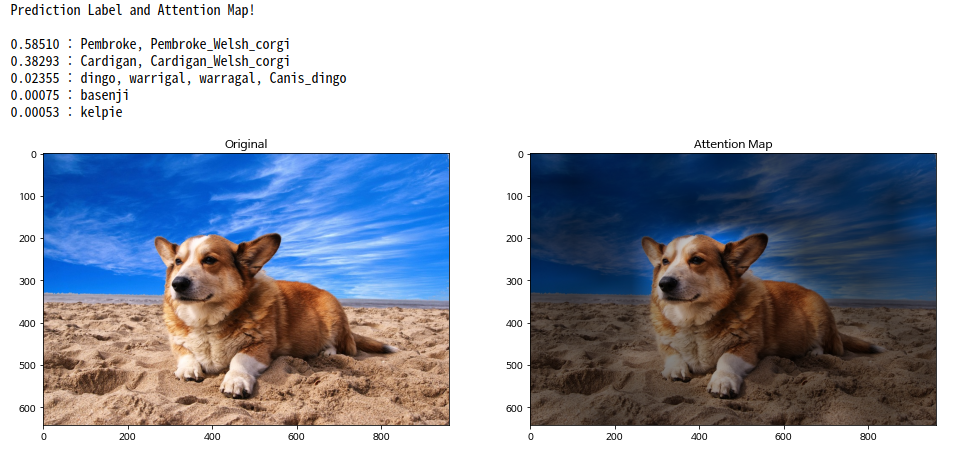

# Vision Transformer
We rebuild the original repo [ViT-pytorch](https://github.com/jeonsworld/ViT-pytorch) to make it cleaner

## Update
We modify the original repo from the following aspects:

**Training**
- [ ] Add `train.sh` for a quick start instead of long training scripts
- [ ] Add `Resume Training`
- [ ] Save model checkpoint to specific named folder
- [ ] Add `Contiguous Tensor` for faster training
- [ ] ~~Rebuild config file in a cleaner way~~

**Dataset**
- [x] Add `Imagenet Dataloader` for imagenet fine-tune experiments
- [x] Rebuild dataloader to make it cleaner, see [data_utils.py](utils/data_utils.py)
 
**README**
- [ ] Decouple README file to make it cleaner
- [ ] Add `Imagenet2012` fine-tune baseline, see [MODEL_ZOO.md](MODEL_ZOO.md)

## Model Overall


Vision Transformer achieve State-of-the-Art in image recognition task with standard Transformer encoder and fixed-size patches. In order to perform classification, author use the standard approach of adding an extra learnable "classification token" to the sequence.


## Usage
### 1. Download Pre-trained model (Google's Official Checkpoint)
* [Available models](https://console.cloud.google.com/storage/vit_models/): ViT-B_16(**85.8M**), R50+ViT-B_16(**97.96M**), ViT-B_32(**87.5M**), ViT-L_16(**303.4M**), ViT-L_32(**305.5M**), ViT-H_14(**630.8M**)
  * imagenet21k pre-train models
    * ViT-B_16, ViT-B_32, ViT-L_16, ViT-L_32, ViT-H_14
  * imagenet21k pre-train + imagenet2012 fine-tuned models
    * ViT-B_16-224, ViT-B_16, ViT-B_32, ViT-L_16-224, ViT-L_16, ViT-L_32
  * Hybrid Model([Resnet50](https://github.com/google-research/big_transfer) + Transformer)
    * R50-ViT-B_16
```
# imagenet21k pre-train
wget https://storage.googleapis.com/vit_models/imagenet21k/{MODEL_NAME}.npz

# imagenet21k pre-train + imagenet2012 fine-tuning
wget https://storage.googleapis.com/vit_models/imagenet21k+imagenet2012/{MODEL_NAME}.npz

```

### 2. Train Model
```
python3 train.py --name cifar10-100_500 --dataset cifar10 --model_type ViT-B_16 --pretrained_dir checkpoint/ViT-B_16.npz
```
CIFAR-10 and CIFAR-100 are automatically download and train. In order to use a different dataset you need to customize [data_utils.py](./utils/data_utils.py).

The default batch size is 512. When GPU memory is insufficient, you can proceed with training by adjusting the value of `--gradient_accumulation_steps`.

Also can use [Automatic Mixed Precision(Amp)](https://nvidia.github.io/apex/amp.html) to reduce memory usage and train faster
```
python3 train.py --name cifar10-100_500 --dataset cifar10 --model_type ViT-B_16 --pretrained_dir checkpoint/ViT-B_16.npz --fp16 --fp16_opt_level O2
```

## Model Zoo
see [MODEL_ZOO.md](MODEL_ZOO.md)


## Visualization
The ViT consists of a Standard Transformer Encoder, and the encoder consists of Self-Attention and MLP module.
The attention map for the input image can be visualized through the attention score of self-attention.

Visualization code can be found at [visualize_attention_map](./visualize_attention_map.ipynb).




## Reference
* [Google ViT](https://github.com/google-research/vision_transformer)
* [Pytorch Image Models(timm)](https://github.com/rwightman/pytorch-image-models)
* [Contiguous Parameters](https://github.com/PhilJd/contiguous_pytorch_params)


## Citations

```bibtex
@article{dosovitskiy2020,
  title={An Image is Worth 16x16 Words: Transformers for Image Recognition at Scale},
  author={Dosovitskiy, Alexey and Beyer, Lucas and Kolesnikov, Alexander and Weissenborn, Dirk and Zhai, Xiaohua and Unterthiner, Thomas and  Dehghani, Mostafa and Minderer, Matthias and Heigold, Georg and Gelly, Sylvain and Uszkoreit, Jakob and Houlsby, Neil},
  journal={arXiv preprint arXiv:2010.11929},
  year={2020}
}
```
